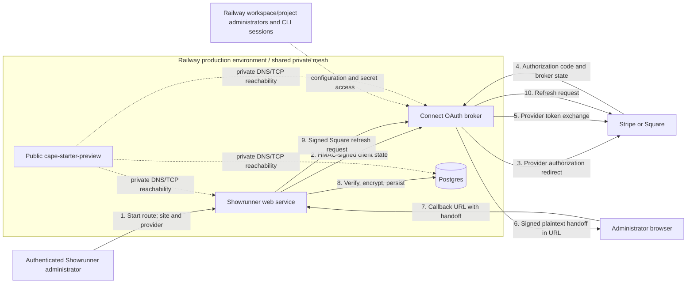

# Admit One Connect Security Audit

**Assessment date:** 2026-07-18  
**Assessment type:** Read-only, evidence-backed application, deployment, integration, and provider review  
**Primary target:** Admit One Connect and `https://connect.admitonedesign.com`  
**Integrated target:** Showrunner and `https://admin.admitonedesign.com`  
**Report status:** Final

> Secret-handling note: this report deliberately contains no credential values, signed states, handoff tokens, authorization codes, cookies, API keys, access tokens, refresh tokens, or HMAC values. Identifiers that function as provider credentials are also suppressed. Evidence is limited to names, presence/type/length booleans, hashes of non-secret source files, statuses, and resource identifiers.

## 1. Executive summary

The audit has confirmed one high-severity design vulnerability: Connect sends Stripe and Square merchant access and refresh credentials through the browser in a signed but unencrypted handoff query parameter. Anyone who obtains the handoff URL can decode its token payload without the HMAC key and use the bearer credentials. A conditional Showrunner path can also copy a callback query into a 400-day attribution cookie and later analytics storage when no landing cookie exists; a normal start generally sets that cookie first, so persistence during a completed valid OAuth flow was not demonstrated and is not the basis for the High severity. No evidence was found that a real credential has already leaked through Railway logs or source control, but the browser handoff creates practical history, extension, proxy, observability, and endpoint-compromise disclosure paths.

The broader posture is **high risk pending remediation of the browser handoff**, with meaningful medium-severity weaknesses in replay controls, provider disconnect/revocation, Square refresh authentication, runtime support, production access controls, network segmentation, availability controls, and build provenance. Several good controls were independently observed: strict registered-origin comparison, provider/client/site binding in signed state, short expirations, timing-safe HMAC comparisons, authenticated Showrunner integration routes, AES-256-GCM token-at-rest encryption, service-scoped Railway variables, current dependency audit results with no known advisories, valid HTTPS/TLS, and generic negative-route errors.

No application code, provider setting, Railway setting, credential, merchant connection, transaction, deployment, Git ref, index entry, tracked application file, or remote state was changed. The only intended repository addition is this report.

## 2. Overall security posture

| Area | Assessment | Basis |
|---|---|---|
| Merchant credential confidentiality | High risk | Bearer credentials traverse a query parameter in a signed, plaintext handoff token. |
| OAuth integrity and tenant binding | Mixed | Strong HMAC, expiry, provider/client/site checks and strict origins; no atomic one-time consumption. |
| Provider lifecycle | Needs improvement | Local disconnect does not revoke provider access or reliably compensate partial setup. |
| Showrunner authorization/storage | Generally sound, one conditional concern | Routes require `settings:update`; AES-256-GCM at rest; multi-site admin isolation could not be established. |
| Railway secret isolation | Mixed | Connect variables are service-scoped, but production is unrestricted and long-lived credentials are retrievable through authenticated CLI sessions. |
| Network/availability | Needs improvement | Unrelated public preview shares the private mesh; single replica; no observed L7 rate limiting; provider requests lack timeouts. |
| Runtime/supply chain | Mixed | `npm audit` found no advisories, but production runs EOL Node 20 and ships development/source material. |
| Provenance/recovery | Weak | Production is a local CLI deployment with no commit provenance and differs from GitHub `main`; no staging environment or evidenced incident/rotation runbook. |

## 3. Scope and methodology

### In scope

- Local Connect workspace at `C:\Users\Abe Tannenbaum\Documents\AdmitOneConnect`.
- Railway project **Admit One**, environment **production**, service **connect**, and adjacent services relevant to trust boundaries.
- Exact Showrunner source deployed by Railway: `Xarindar/showrunner` at commit `d30f6d8d7d87b91740151cb4f0ed13a31d84430d`.
- Stripe Connect and Square production OAuth configuration, inspected read-only.
- Current official Stripe, Square, Railway, Node.js, Express, and standards documentation.

### Methods

- Four bounded audit branches: Connect code, Railway operations, Showrunner integration, and provider configuration/end-to-end threat model.
- Main-agent source review and independent reproduction of every Critical/High finding and feasible Medium findings.
- Exact deployed-source/hash comparison, Railway metadata inspection, redacted variable-contract checks, log-pattern checks, and service inventory.
- Clean isolated install/build/lint/typecheck, existing-test discovery, `npm audit`, dependency inventory, source/history/artifact secret-pattern scans with values suppressed.
- Safe HTTP health, negative-route, redirect, header, and TLS probes.
- Synthetic signed OAuth-start requests for Stripe and Square without following provider consent and without exchanging authorization codes.
- Local-only synthetic replay and token-structure tests with placeholder credentials.
- Read-only provider-dashboard inspection. No merchant token or merchant identity was opened.

### Constraints

- No real provider authorization, token exchange, refresh, revocation, disconnect, transaction, refund, or merchant-account mutation was performed.
- Workspace/project membership roles, MFA enforcement, external SIEM/uptime monitoring, DNS-account controls, and organization-external runbooks were not fully observable.
- A conditional multi-site authorization concern could not be safely exercised against production.

## 4. Architecture and trust-boundary diagram

**Trust-boundary observations:** provider bearer credentials cross the provider-to-Connect server boundary safely over TLS, but then cross a server-to-browser boundary in readable form before returning to Showrunner. Railway’s production environment places all services on one private mesh; service authentication, not network segmentation, is therefore the principal east-west control.

## 5. Sensitive assets and data-flow inventory

| Asset | Source | Transit/storage | Principal risk |
|---|---|---|---|
| Stripe platform credential | Railway Connect variable | Server-side provider API calls | Railway/admin or runtime compromise enables platform-level provider actions. |
| Square application secret | Railway Connect variable | Server-side token exchange/refresh | Same; also authenticates application to Square OAuth endpoints. |
| Broker signing secret | Railway Connect variable | HMAC of broker state/handoff | Compromise permits broker-state/handoff forgery. |
| Per-client shared secret | Both Connect and Showrunner variables | HMAC of client state and refresh requests | Compromise affects the registered Showrunner client relationship. |
| Merchant access/refresh tokens | Provider response | Connect memory -> browser URL -> Showrunner -> AES-256-GCM database ciphertext | Browser/front-channel disclosure and replay are the dominant confirmed risks. |
| OAuth authorization code | Provider callback query | Browser -> Connect -> provider token endpoint | Short-lived/single-use, but callback state is not consumed atomically. |
| Client and broker state | Browser URL | HMAC-signed, short-lived | Integrity protected; no server-side nonce ledger prevents repeated use. |
| Showrunner nonce cookie | Browser cookie | `HttpOnly`, `Secure`, `SameSite=Lax` | Good browser binding, but concurrent replays can race before cookie deletion. |
| Site/provider binding | Signed state and handoff | Verified by both services | Positive control against simple cross-provider/site substitution. |
| Encrypted payment integration record | Postgres | AES-256-GCM with random IV and dedicated key | Database-only theft is mitigated; app/key compromise still reveals tokens. |

## 6. Attack-surface inventory

| Surface | Authentication/integrity | Exposure and observations |
|---|---|---|
| `GET /health` | None | Public; one-process availability target; returns minimal JSON. |
| `GET /connect/:provider/start` | HMAC client state | Public; verifies client/provider/time/origin, then redirects to provider. |
| `GET /connect/:provider/callback` | HMAC broker state | Public; performs provider exchange and redirects with handoff query. |
| `POST /connect/square/refresh` | Raw-body HMAC | Public; lacks timestamp, nonce, site, path, or replay ledger. |
| Showrunner integration start/callback/disconnect routes | Session plus `settings:update` | Unauthenticated probes redirected to sign-in. Callback receives bearer credentials in URL. |
| Railway custom domains | TLS/public edge | Valid HTTPS; Connect has no observed application-layer rate limiter/WAF policy. |
| Railway private mesh | Environment-wide | Includes Connect, Showrunner, Postgres, production sites, and a public preview workload. |
| Railway CLI/project access | Railway account/session | Production unrestricted; relevant long-lived variables are unsealed/retrievable. |
| Stripe/Square dashboards | Provider account authentication | Exact production callback URIs verified; account/MFA/audit settings were outside observable scope. |
| Dependency/build chain | npm lockfile + Railpack/Nixpacks | No current npm advisories; Connect runtime selected unsupported Node 20. |

## 7. Prioritized findings table

| ID | Severity | Status | Finding | Scope |
|---|---|---|---|---|
| AOC-001 | **High** | Verified | Merchant bearer credentials cross the browser in a readable handoff URL; conditional attribution capture can amplify exposure | Local and production design |
| AOC-002 | Medium | Verified | OAuth state and handoff artifacts are not atomically one-time | Local and production design |
| AOC-003 | Medium | Verified | Square refresh authentication is replayable | Local and production design |
| AOC-004 | Medium | Verified | Disconnect and failed setup do not revoke provider access or fully compensate | Showrunner/production behavior |
| AOC-005 | Medium | Verified | Production Connect runs EOL Node.js 20 | Production; permissive local engine contract |
| AOC-006 | Medium | Verified | Unrestricted Railway production exposes unsealed credentials to authenticated sessions | Production operations |
| AOC-007 | Medium | Partially verified | Public preview workload shares the production private mesh | Production operations |
| AOC-008 | Medium | Verified | No application-layer rate limiting or bounded provider timeouts; single-replica recovery is weak | Local and production |
| AOC-009 | Medium | Verified | Production has no immutable source provenance and the deployed/local branch diverges from an incompatible security patch on GitHub `main` | Local and production deployment |
| AOC-014 | Medium | Verified | Railway does not schedule the documented Square refresh worker; no in-scope stale-token alert was evidenced | Showrunner production operations |
| AOC-010 | Low | Verified | Baseline HSTS and response-header hardening is absent | Production and local behavior |
| AOC-011 | Low | Verified | Production image includes source, maps, documentation, and development tooling | Production image |
| AOC-012 | Low | Partially verified | Security regression, staging, incident-response, and rotation readiness are weak or unevidenced | Local and operations |
| AOC-015 | Low | Verified | Square silently binds multi-location sellers to the alphabetically first active location | Local and production design |
| AOC-013 | Informational | Verified | Persistent account-scoped Railway CLI access has cross-project blast radius | Developer operations |

No Critical issue was verified. “Verified” means the main audit independently confirmed the cited evidence or safe behavior; “Partially verified” identifies a confirmed condition whose exploit consequence depends on an unobserved prerequisite.

**Finding classification:** AOC-001 through AOC-003 are confirmed exploitable design vulnerabilities. AOC-004 through AOC-009, AOC-014, and AOC-015 are verified or partially verified security/availability/control defects with stated prerequisites; they are not presented as unconditional compromise. AOC-010 through AOC-013 are defense-in-depth, resilience, image-minimization, testing, and administrative hardening recommendations. UR items are explicitly unverified and are excluded from the prioritized remediation count.

## 8. Detailed verified findings

### AOC-001 — Merchant bearer credentials cross the browser in a readable handoff URL; conditional attribution capture can amplify exposure

- **Severity:** High
- **Verification status:** Verified
- **Confidence:** High
- **Affected component:** Connect `src/lib/tokens.ts:7-10,32-35,44-82`; Connect `src/server.ts:169-182`; Showrunner `app/api/payments/connect/[provider]/callback/route.ts:39-51`; `lib/payments/connect/flow.ts:178-229,241-275`; `proxy.ts:49,59,67`; Showrunner event attribution `lib/events/emit.ts:105-145,173-225` at deployed commit `d30f6d8d7d87b91740151cb4f0ed13a31d84430d`.
- **Location:** Both local design and production. The deployed Connect source was byte-identical to the local source for the affected files.
- **Evidence:** Connect serializes the complete handoff payload—including access and refresh token fields—as JSON, base64url-encodes it, and appends an HMAC. The HMAC provides integrity but no confidentiality. The callback sends this artifact as `?handoff=` in a `Location` response. A local synthetic test recovered both placeholder token fields by decoding only the first segment, without the signing key. A deployed callback probe containing only a harmless marker confirmed that Showrunner’s proxy copies the full callback path and query into the `sr_landing_page` cookie for up to 34,560,000 seconds (400 days) **when the cookie is absent**; event-attribution code can later persist that value. A normal OAuth start generally establishes the landing cookie before the callback, so the audit did not demonstrate overwrite/persistence during a completed valid flow. The callback lacked `Cache-Control: no-store` and `Referrer-Policy`. Railway log scans found no real handoff or credential pattern, and Railway access-log paths omitted query strings; this bounded negative result does not cover browser/proxy/APM systems.
- **Attack prerequisites:** Read access to the callback URL through browser history/sync, an extension, endpoint compromise, screenshot/support tooling, reverse-proxy/APM capture, or referrer propagation. Conditional cookie/database capture additionally requires the landing cookie to be absent. The attacker does not need either HMAC secret after obtaining the URL.
- **Concrete exploit scenario:** A browser extension or compromised endpoint reads a completed `/callback?handoff=...` URL, base64url-decodes the signed payload, and uses the exposed provider bearer token before revocation/expiry. If a refresh token is present, access can persist beyond the first access-token lifetime.
- **Business/technical impact:** Unauthorized access to the connected merchant account within granted scopes, including payment/order/refund operations and merchant data; potentially long-lived compromise through refresh capability.
- **Recommended remediation:** Replace the front-channel payload with a high-entropy, opaque, short-lived, single-use code. Store the encrypted token bundle server-side, bind the code to client/site/provider/session/nonce, redeem it from Showrunner over authenticated back-channel POST, and atomically consume it. Add `Cache-Control: no-store`, `Pragma: no-cache`, and a restrictive `Referrer-Policy`; explicitly exclude OAuth callback queries from attribution, analytics, logs, and error reporting.
- **Recommended verification test:** Complete a synthetic provider-stub flow and assert that browser URLs/cookies/history contain only an opaque one-time code; assert a second redemption fails; scan browser, proxy, APM, analytics, and application logs for marker absence.
- **Standards context:** OAuth bearer tokens should not be placed in page URLs because URLs are routinely logged and exposed ([RFC 6750 §2.3 and §5](https://datatracker.ietf.org/doc/html/rfc6750.html)). Square likewise instructs applications to encrypt/store OAuth tokens server-side rather than expose them to application clients ([Square OAuth overview](https://developer.squareup.com/docs/oauth-api/overview)).

### AOC-002 — OAuth state and handoff artifacts are not atomically one-time

- **Severity:** Medium
- **Verification status:** Verified
- **Confidence:** High
- **Affected component:** Connect `src/server.ts:125-182`; `src/lib/tokens.ts:44-82`; Showrunner callback `app/api/payments/connect/[provider]/callback/route.ts:13-19,44-66`; Showrunner flow `lib/payments/connect/flow.ts:110-149`.
- **Location:** Both local and production design.
- **Evidence:** Verification checks signature and expiration but maintains no consumed-state/JTI ledger. In an independent local provider-stub test, the exact same valid broker state and placeholder authorization code produced two HTTP 302 handoffs and invoked the Stripe exchange stub twice. Showrunner deletes the nonce cookie only in the response and has no atomic server-side consume operation, so concurrent callbacks can pass the same precondition. Stripe documents that its authorization code is one-use and that repeated token-endpoint consumption is non-idempotent and can revoke the connection.
- **Attack prerequisites:** Access to a still-valid signed state or handoff plus, for Showrunner, the bound browser session/nonce cookie or a concurrency race.
- **Concrete exploit scenario:** Browser refresh/back or two concurrent callback requests repeat the same broker exchange or Showrunner provisioning. On Stripe, repeated exchange of the same code can revoke the new connection; in Showrunner, duplicate provisioning can race webhook/database side effects.
- **Business/technical impact:** Connection denial, inconsistent integration state, duplicate side effects, and a wider replay window for a stolen handoff.
- **Recommended remediation:** Give every state and handoff a random identifier; store a short-lived hash server-side; atomically transition `unused -> consumed`; make callback/provisioning idempotent; return a safe terminal response on replay.
- **Recommended verification test:** Send two simultaneous synthetic callback/redemption requests and assert exactly one provider exchange and one database/provisioning transaction occur; assert the other receives a generic replay error.

### AOC-003 — Square refresh authentication is replayable

- **Severity:** Medium
- **Verification status:** Verified
- **Confidence:** High
- **Affected component:** Connect `src/server.ts:186-200`; `src/lib/signatures.ts:4-20`; Showrunner Square refresh request `lib/payments/connect/square-refresh.ts:33-44`; Showrunner signing helper `lib/payments/connect/tokens.ts:61-62`.
- **Location:** Local and production design.
- **Evidence:** The HMAC covers the raw JSON body, including `client_id` and the refresh-token field, so client/body tampering is detected. It does not bind a timestamp, request ID/nonce, HTTP method/path, site ID, or expiry, and Connect stores no replay record. A local provider stub accepted the same synthetically signed request twice. A deployed request without a signature returned 401, confirming signature enforcement but not freshness. Square documents that code-flow refresh tokens are reusable and do not expire until revoked, so provider behavior does not supply one-time semantics.
- **Attack prerequisites:** Capture of one valid internal refresh request, such as through compromised Showrunner/Railway runtime, instrumentation, or east-west traffic visibility.
- **Concrete exploit scenario:** An attacker replays the captured body/header repeatedly, causing repeated provider calls and returning fresh access credentials to the caller while the long-lived Square refresh token remains valid.
- **Business/technical impact:** Credential refresh oracle, availability/cost abuse, and extended utility of a captured signed request.
- **Recommended remediation:** Sign a canonical envelope containing version, client/site/provider, method, path, body digest, issued-at, expiry, and a high-entropy nonce. Reject skewed timestamps and atomically record nonce consumption. Prefer a mutually authenticated/private service call where available.
- **Recommended verification test:** Replay the exact signed request and assert the second request is rejected before any provider call; test timestamp skew, path substitution, client/site substitution, and body tampering.

### AOC-004 — Disconnect and failed setup do not revoke provider access or fully compensate

- **Severity:** Medium
- **Verification status:** Verified
- **Confidence:** High
- **Affected component:** Showrunner `modules/payments/actions.ts:379-396`; `lib/payments/connect/flow.ts:159-175`; `lib/payments/provider-onboarding.ts:238-253`; Connect has no revocation/deauthorization route.
- **Location:** Showrunner integration and production design.
- **Evidence:** Disconnect clears local encrypted credentials/status but does not call Stripe deauthorization or Square token revocation. Stripe webhook provisioning failures are caught while the connection can still be marked connected; later database failure after provider authorization/provisioning has no compensating provider cleanup.
- **Attack prerequisites:** A merchant disconnects, a setup step fails, or an operator assumes local deletion revokes upstream access.
- **Concrete exploit scenario:** After a Showrunner disconnect, a previously disclosed or retained provider token remains usable until provider expiry/revocation; an orphan Stripe webhook can remain active after local failure.
- **Business/technical impact:** Continued upstream access inconsistent with merchant intent, orphaned callbacks, confusing partial states, and slower incident containment.
- **Recommended remediation:** Add broker-mediated Stripe deauthorization and Square revoke operations; authorize and audit them; remove provider webhooks; model explicit pending/connected/disconnecting/revoked/failed states; implement compensating cleanup with retry/tombstone queues.
- **Recommended verification test:** Against sandbox fixtures, disconnect and inject failures after each step; assert provider token status is revoked, webhooks are removed, local state is terminal/consistent, and retries are idempotent.

### AOC-005 — Production Connect runs EOL Node.js 20

- **Severity:** Medium
- **Verification status:** Verified
- **Confidence:** High
- **Affected component:** Active Connect runtime and `package.json:6-8`.
- **Location:** Production; local contract permits the same selection.
- **Evidence:** The active image contains `/mise/installs/node/20.20.2`; `package.json` specifies only `node >=20`, so Railpack selected Node 20. Node 20 reached end of life on 2026-03-24 and no longer receives security fixes. Node’s June 2026 security release confirms supported lines received additional security fixes and states that EOL versions are affected; production remains on the EOL line. Connect’s fixed ASCII provider hostnames did not establish reachability of the cited Unicode-hostname TLS issue, and no application-specific CVE exploit was reproduced. The local audit host used Node 22.17.0, also older than the current supported-major security patch level observed in official releases.
- **Attack prerequisites:** A known or future Node 20 vulnerability must affect code reachable through Connect’s actual HTTP, parsing, TLS, or runtime behavior; prerequisites vary by issue.
- **Concrete exploit scenario:** After supported Node lines receive a fix, an attacker applies the corresponding affected-code-path technique to the permanently unpatched Node 20 service before operators migrate it.
- **Business/technical impact:** Loss of availability, confidentiality, or request/TLS integrity depending on the reachable issue. No current application-level exploit was demonstrated.
- **Recommended remediation:** Pin an exact supported, patched LTS line (currently Node 24 or a supported Node 22 release), rebuild from the lockfile, and establish automated runtime-EOL/security-release alerts.
- **Recommended verification test:** Confirm the rebuilt image’s runtime version, rerun all security/regression tests, and verify a policy rejects EOL majors.
- **Official basis:** [Node release schedule](https://nodejs.org/en/about/previous-releases), [Node EOL policy](https://nodejs.org/en/about/eol), and [June 2026 security releases](https://nodejs.org/en/blog/vulnerability/june-2026-security-releases).

### AOC-006 — Unrestricted Railway production exposes unsealed credentials to authenticated sessions

- **Severity:** Medium
- **Verification status:** Verified
- **Confidence:** High
- **Affected resource:** Railway production environment `838af607-18fd-4007-b53c-d7aa4ca8ca4a`; Connect service `3bc48992-89eb-4d9d-a5e6-c85456321c46`; Showrunner service `785c8f23-f571-4abd-8f72-8b783de6a960`.
- **Location:** Production.
- **Evidence:** Railway metadata reports `restricted:false`. Metadata-only checks proved that Connect’s broker signing secret, live-type Stripe credential, Square application secret, and client registry—and Showrunner’s shared client secret, payment-encryption/authentication material, and database-connectivity credential classes—are retrievable into authenticated CLI subprocesses; only booleans/counts/type checks were emitted. Railway’s sealed variables are not returned to CLI/run contexts, so these values are unsealed. The project is private and shared variables are empty; tested Connect-specific names were absent from other services, preserving service-variable separation but not protecting against an authorized environment session.
- **Attack prerequisites:** A malicious project member, compromised Railway account, or stolen persistent CLI session.
- **Concrete exploit scenario:** A compromised developer session retrieves broker/provider credentials and forges state/handoffs or acts as the provider application; access to Showrunner database plus encryption/authentication material can expand this to stored merchant integrations.
- **Business/technical impact:** Provider-platform misuse, merchant-integration compromise, compromise of the sole registered client trust relationship, and potentially decrypted Showrunner payment credentials when combined with database access.
- **Recommended remediation:** Restrict production through Environment RBAC, minimize administrators, seal long-lived secrets where operationally compatible, retain service scoping, require MFA/session review, and use narrowly project-scoped automation identities. Review access before any later credential rotation.
- **Recommended verification test:** From a non-admin test identity, confirm production variables/config/logs are denied; confirm sealed values are not returned by CLI/run while the deployment still receives them.
- **Official basis:** [Railway variables and sealed variables](https://docs.railway.com/variables) and [Environment RBAC](https://docs.railway.com/enterprise/environment-rbac).

### AOC-007 — Public preview workload shares the production private mesh

- **Severity:** Medium
- **Verification status:** Partially verified
- **Confidence:** High for topology; Medium for exploit consequence
- **Affected resource:** `cape-starter-preview` (`912d0e72-7da7-45c8-9597-44ab80f4333c`) and private network `c67a04ab-fc61-4c5a-8855-3adf23449af9` shared with Connect, Showrunner, and Postgres.
- **Location:** Production.
- **Evidence:** The preview is publicly reachable at `capestarter-demo.up.railway.app`, has no repository source, and is on the same environment-wide private mesh. Tested Connect secret names were not present on the preview. Railway documents that environment services can communicate over private DNS/TCP/UDP.
- **Attack prerequisites:** Compromise of the public preview workload; application/database authentication must then also be bypassed for deeper impact.
- **Concrete exploit scenario:** A preview compromise resolves and probes internal Connect, Showrunner, and Postgres endpoints, avoiding controls applied only at public domains.
- **Business/technical impact:** Enlarged lateral-movement and reconnaissance surface; no direct database or secret compromise was demonstrated.
- **Recommended remediation:** Move unrelated preview workloads to a separate project/environment/private mesh; remove public domains and orphan services after owner confirmation; continue authenticating every internal endpoint.
- **Recommended verification test:** From the isolated preview environment, assert production private DNS names no longer resolve and ports are unreachable.

### AOC-008 — No application-layer rate limiting or bounded provider timeouts; single-replica recovery is weak

- **Severity:** Medium
- **Verification status:** Verified
- **Confidence:** High
- **Affected component:** Connect `src/server.ts:73-238`; provider calls `src/lib/providers.ts:69-162`; client lookup `src/lib/registry.ts:53-59`; Railway Connect service `3bc48992-89eb-4d9d-a5e6-c85456321c46`.
- **Location:** Local and production.
- **Evidence:** No route/global rate limiter is implemented. Provider `fetch` calls use no abort signal/timeout. `lookupClient` indexes a normal object without an own-property check; a local exact-code probe using public `client_id=constructor` plus a structurally valid synthetic state deterministically returned HTTP 500, establishing a cheap error/log-amplification path. Production has one replica in `sfo`, restart policy `ON_FAILURE` with three retries, and only a deploy-time `/health` check. Railway WAF Under Attack Mode was disabled. A bounded 100-request `/health` probe returned 100 HTTP 200 and no 429. Positive request controls are a 64 KB JSON-body cap and disabled `x-powered-by` header at `src/server.ts:73-84`. Railway health checks are deployment gates rather than continuous monitoring.
- **Attack prerequisites:** Internet access for cheap health/invalid-route work; valid signed state is needed to force the most expensive provider exchanges, but an authenticated Showrunner user can initiate state.
- **Concrete exploit scenario:** A request flood or intentionally slow/unresponsive provider call consumes the single Node process’s sockets/CPU, triggers crashes, or exhausts the limited restart budget.
- **Business/technical impact:** OAuth onboarding and Square refresh outage, operational cost, and prolonged recovery.
- **Recommended remediation:** Add per-route/IP/client rate limits, concurrency caps, provider-call abort deadlines, circuit breakers, body/header timeouts, and cost/error alerts; require own-property lookup or a null-prototype/`Map` registry; place a suitable L7 control in front; use at least two replicas and continuous uptime/SLO monitoring.
- **Recommended verification test:** Load-test staging to confirm 429 behavior, bounded provider latency, alert delivery, and continued service after one replica terminates; assert inherited property names receive a generic 400 without a stack/error log.
- **Official basis:** [Railway health checks](https://docs.railway.com/deployments/healthchecks), [public-network limits](https://docs.railway.com/networking/public-networking), and [Express production security practices](https://expressjs.com/en/advanced/best-practice-security/).

### AOC-009 — Production has no immutable provenance and the deployed/local branch diverges from an incompatible security patch

- **Severity:** Medium
- **Verification status:** Verified
- **Confidence:** High
- **Affected component:** Connect source/deployment pipeline; Railway deployment `073348ce-5313-4f94-87e1-6057cc88e425`; GitHub `Xarindar/AdmitOneConnect`.
- **Location:** Local and production operations.
- **Evidence:** The deployment has `source.repo=null` and no commit hash. Inspected deployed source files are byte-identical to local HEAD `a71f19c01947767b9416956c49e7f0b11e6b02b6`; `src/server.ts` hashes to `512F64B892E36918EE9C3077ECE33BD05BDBCCD1BD2565930E0A1C4D9DA334E6` in both places. Local and GitHub branches diverge from common commit `20409279e8ad61f67ac9a16058b82bbbfbce18e9`: the local-only commit is documentation, while GitHub `main` is `45da3c1c60213c819e25fbb3993072b18a9d6058`, titled `Patch OAuth broker security issues`. Main-agent review of all changed source found that the GitHub commit encrypts handoffs, wraps Square refresh tokens, adds token types, request timestamps/nonces, HTTPS normalization, and error sanitization. It directly addresses important portions of AOC-001 and AOC-003. It is **not deployable by itself** against the active Showrunner contract: it requires typed client states, AES-GCM handoff opening, and a different Square refresh body/handle contract that deployed Showrunner does not implement. The patch still lacks atomic OAuth/handoff consumption, durable cross-replica refresh replay storage, provider timeouts/rate limits, and provider revocation. Local `railway.json` is also untracked.
- **Attack prerequisites:** A vulnerable old-code path (covered by AOC-001/AOC-003) or an operator deploying one side of the incompatible contract without coordinated review.
- **Concrete exploit scenario:** Security-sensitive changes remain on a divergent, untested branch while the untraceable local build stays live; alternatively, an emergency operator deploys GitHub `main` alone and breaks every current Showrunner start/handoff/refresh flow.
- **Business/technical impact:** Known design weaknesses remain deployed, review status is ambiguous, rollback/source reproduction is harder, and an attempted urgent fix can cause a production integration outage.
- **Recommended remediation:** Reconcile local/GitHub history without blindly deploying either branch; review and version the protocol contract; update Connect and Showrunner compatibly; add CI integration/security tests; deploy an immutable reviewed commit or attested artifact; record its SHA in Railway metadata.
- **Recommended verification test:** In staging, run old/new compatibility matrices, then assert both deployed services report reviewed SHAs and their source hashes match those commits; reject source-less CLI deployments in production policy.

### AOC-014 — Railway does not schedule the documented Square refresh worker; no in-scope stale-token alert was evidenced

- **Severity:** Medium
- **Verification status:** Verified
- **Confidence:** High
- **Affected component:** Showrunner `README.md:99`; `package.json:25`; `scripts/refresh-square-tokens.ts:8-14`; `lib/payments/connect/square-refresh.ts:15,76-95`; Railway Showrunner service instance `d1f43a9d-4db5-462b-963f-e8041db38c4e`.
- **Location:** Production operations and deployed Showrunner source.
- **Evidence:** Source comments require `npm run payments:refresh-square` on a daily schedule, but Railway production has no service instance with a cron schedule and the Showrunner web process only starts the application. The worker selects credentials only when they are within 14 days of expiry; request-path fallback starts within 7 days. Square’s current guidance recommends automatic renewal every 7 days or less and an alert when a retrieved token is older than 8 days so failures are found well before the 30-day access-token expiry. No Railway/in-scope scheduler or corresponding age/failure alert was evidenced; an external scheduler outside Railway was not observable.
- **Attack prerequisites:** No attacker is required. A dormant merchant connection plus scheduler omission, broker/provider outage, revoked credential, or refresh-contract failure is sufficient.
- **Concrete exploit scenario:** A merchant has no payment/refund traffic for weeks, so the request-path fallback never runs. The access token approaches or reaches expiry; the first later customer payment discovers a refresh failure synchronously, after the useful repair buffer has been lost.
- **Business/technical impact:** Preventable Square payment/refund outage and delayed discovery of revoked/broken connections. This is an availability/recovery defect, not unauthorized access.
- **Recommended remediation:** Run an idempotent daily Railway cron/worker or external scheduler; renew each OAuth access token at least every seven days; record last successful refresh; alert before the eight-day threshold and on every failed batch; expose connection health accurately. Reconcile this with the redesigned refresh contract in AOC-003/AOC-009.
- **Recommended verification test:** With a provider stub and synthetic expiring credential, assert the scheduled worker runs daily, refreshes according to a <=7-day cadence, produces no duplicate side effects, updates health metadata, and pages on injected broker/provider failure before expiry.
- **Official basis:** [Square refresh/revoke/scope guidance](https://developer.squareup.com/docs/oauth-api/refresh-revoke-limit-scope) and [Square OAuth best practices](https://developer.squareup.com/docs/oauth-api/best-practices).

### AOC-015 — Square silently binds multi-location sellers to the alphabetically first active location

- **Severity:** Low
- **Verification status:** Verified
- **Confidence:** High
- **Affected component:** Showrunner `lib/payments/provider-onboarding.ts:100-117`; `lib/payments/connect/flow.ts:253-260`.
- **Location:** Local and production design.
- **Evidence:** Showrunner calls `GET /v2/locations`, filters out inactive locations, and selects `usable[0]` without presenting a post-consent choice. Square documents that ListLocations returns locations alphabetically by name, so the selected item is not necessarily the seller’s main or intended location.
- **Attack prerequisites:** No attacker is required. The connected Square seller must have multiple active locations and intend a location other than the alphabetically first one.
- **Concrete exploit scenario:** A seller authorizes the correct Square account for a specific Showrunner site, but Showrunner stores another active location ID; subsequent payment links/orders/refunds are attributed to the wrong location or business unit.
- **Business/technical impact:** Misrouted operational attribution, reconciliation errors, and possible settlement/reporting confusion; the merchant account itself remains correctly bound.
- **Recommended remediation:** After OAuth, show verified merchant and active-location names and require an authorized administrator to select the location for the site. Bind and audit that selection; make later changes explicit.
- **Recommended verification test:** Stub an account with two active locations in an order opposite the user’s intent and assert connection cannot complete until an explicit site-bound choice is made.
- **Official basis:** [Square ListLocations](https://developer.squareup.com/reference/square/locations/list-locations).

### AOC-010 — Baseline HSTS and response-header hardening is absent

- **Severity:** Low
- **Verification status:** Verified
- **Confidence:** High
- **Affected component:** Connect `src/server.ts:73-238`, routes `GET /health`, `GET /connect/:provider/start`, and `GET /connect/:provider/callback`; Showrunner `app/api/payments/connect/[provider]/callback/route.ts:13-66` and `proxy.ts:49-67`; both production domains.
- **Location:** Local behavior and production.
- **Evidence:** Safe production probes found no `Strict-Transport-Security`, `X-Content-Type-Options`, or frame-ancestors/frame-protection policy on Connect health/start/callback-denial responses; Showrunner also lacked HSTS and these baseline protections, with a limited CSP. Missing OAuth `no-store`/referrer controls are already counted as an AOC-001 amplifier and are not counted again here.
- **Attack prerequisites:** An HTTPS downgrade opportunity before a policy is learned, browser content sniffing, or an attacker-controlled framing context; exploitability depends on browser and route behavior.
- **Concrete exploit scenario:** A first-visit user is not protected by an application HSTS policy, or an authenticated admin page is embedded for UI redress where platform/browser controls do not otherwise block it.
- **Business/technical impact:** Defense-in-depth loss. No standalone downgrade, MIME-confusion, or clickjacking exploit was demonstrated.
- **Recommended remediation:** Add HSTS after confirming all subdomains are HTTPS-ready; set `nosniff` and an explicit `frame-ancestors` policy; use Helmet or an equivalent deliberate route-aware header policy. Apply the separate OAuth cache/referrer controls under AOC-001.
- **Recommended verification test:** Assert exact baseline headers across both domains and exact `no-store`/referrer headers on every OAuth start/callback/error response; run a browser framing test with synthetic sessions.

### AOC-011 — Production image includes source, maps, documentation, and development tooling

- **Severity:** Low
- **Verification status:** Verified
- **Confidence:** High
- **Affected resource:** Active Connect image digest `sha256:6e630f1e0f718e2fbcc0a4546b3b23d8082978846e2baa9e38ec3a0196bddac0`.
- **Location:** Production.
- **Evidence:** The runtime filesystem includes `src`, compiled output/source maps, setup/readme/plan documents, and development packages such as TypeScript/tsx/types. No `.env` file was present, and a value-suppressed scan of 27 retrieved artifact files found zero high-confidence credential indicators.
- **Attack prerequisites:** Existing file disclosure, container access, or code execution.
- **Concrete exploit scenario:** A foothold uses full source/maps/docs and extra runtime tooling for reconnaissance and post-exploitation.
- **Business/technical impact:** Increased post-compromise capability and dependency surface; no public source-file route was identified.
- **Recommended remediation:** Use a multi-stage build containing compiled runtime output and production dependencies only; omit source maps/docs unless operationally necessary.
- **Recommended verification test:** Enumerate the rebuilt image and assert only allow-listed runtime paths/packages are present.

### AOC-012 — Security regression, staging, incident-response, and rotation readiness are weak or unevidenced

- **Severity:** Low
- **Verification status:** Partially verified
- **Confidence:** High for repository/Railway inventory; Medium organization-wide
- **Affected component:** Connect `package.json:9-15`, repository test inventory, Railway project `20900b03-1e55-4afc-b525-23d4b80c65f2` / environment `838af607-18fd-4007-b53c-d7aa4ca8ca4a`, and reviewed operational documentation.
- **Location:** Local and production operations.
- **Evidence:** No test files or test script were present. Railway has only `production`; Connect’s three visible deployments were all from the audit date. Repository documentation did not evidence credential rotation, rollback/recovery, provider revocation, incident ownership/communications, backup, or staging procedures. External runbooks may exist and were not observable. Runtime monitoring/availability controls are assessed separately in AOC-008.
- **Attack prerequisites:** A security regression, provider/platform incident, faulty deployment, or credential compromise.
- **Concrete exploit scenario:** Operators must discover replay/rotation/rollback ordering during an incident and test changes directly in production.
- **Business/technical impact:** Longer outage/exposure and greater risk of incomplete revocation or inconsistent state.
- **Recommended remediation:** Add security-focused automated tests, a synthetic non-production environment, and an exercised runbook covering rollback, provider deauthorization, every credential’s rotation order, owner/contact paths, and communications.
- **Recommended verification test:** Run CI policy checks plus a tabletop and sandbox rollback/rotation exercise; require evidence artifacts and action owners.

### AOC-013 — Persistent account-scoped Railway CLI access has cross-project blast radius

- **Severity:** Informational
- **Verification status:** Verified
- **Confidence:** High
- **Affected component:** Developer workstation Railway CLI session.
- **Location:** Local operations.
- **Evidence:** The CLI is authenticated through a persistent personal session rather than a project token and can enumerate multiple projects across two workspaces. Local token-file ACLs are appropriately limited to the user, Administrators, and SYSTEM. No token value was inspected or copied.
- **Attack prerequisites:** Local malware/account compromise or theft of the persisted session.
- **Concrete exploit scenario:** A compromised workstation affects multiple Railway projects instead of only Admit One.
- **Business/technical impact:** Wider administrative/deployment blast radius.
- **Recommended remediation:** Prefer project-scoped automation tokens, minimize persistent admin sessions, enforce MFA and endpoint security, and review sessions/access regularly.
- **Recommended verification test:** Confirm automation cannot enumerate or mutate projects outside Admit One and that session revocation/logout invalidates access.

## 9. Unverified concerns and false positives

### Unverified concerns

- **UR-001 — Conditional cross-site administrator access.** Showrunner’s global administrator/session model and host-resolved site context could permit a user with `settings:update` to act across sites if one deployment contains mutually distrusting sites. The production site count and membership model were not safely observable, so no cross-tenant vulnerability is asserted. A synthetic two-site authorization test is required.
- **UR-002 — Square scope-name drift.** Production launches request `MERCHANT_PROFILE_READ`, `PAYMENTS_READ/WRITE`, `ORDERS_READ/WRITE`, plus `REFUNDS_READ/WRITE`. The first five match current Showrunner location, payment-link, refund, and webhook use. The two `REFUNDS_*` names do not appear in Square’s current OAuth permission enum/reference; current refunds use `PAYMENTS_READ/WRITE`. An unauthenticated synthetic launch reached Square sign-in with no immediate invalid-scope response, but validation after login/consent was not tested. This may be an availability/configuration defect, not an extra-privilege vulnerability. Remove only after a sandbox consent/endpoint matrix confirms the intended five-scope contract.
- Workspace/project membership count and roles, MFA enforcement, audit-log availability/retention, DNS-account security, and external monitors/SIEM/pager/cost alerts were not fully observable.
- Equivalent secrets could exist under unrelated variable names in adjacent services; tested Connect contract names were isolated.
- Provider account-level MFA, user roles, audit history, webhook-event subscriptions, and all previously granted merchant scopes/tokens were not opened.

### Investigated controls / false positives

- **Open redirect:** Not reproduced. Connect parses return URLs, requires HTTPS in the registered production contract, and compares exact origin to the registered origin before redirecting.
- **Provider/client/site substitution:** Not reproduced. OAuth state and handoff validation binds provider/site, client-specific secrets/registry bind the client, and Showrunner rechecks provider, site, expiry, signature, and nonce cookie. Square refresh covers `client_id` in its signed body but lacks site/freshness binding, which is AOC-003.
- **HMAC timing leak:** Not found. Verification checks equal lengths and uses `crypto.timingSafeEqual`.
- **Unsigned Square refresh:** Rejected with HTTP 401 in production. The actual issue is replay/freshness, not absence of authentication.
- **Unauthenticated Showrunner integration access:** Not reproduced. Start and callback probes redirected to sign-in and sensitive routes require `settings:update`.
- **Token-at-rest plaintext:** Not found. Showrunner uses AES-256-GCM with a random 96-bit IV and a dedicated payment-encryption key.
- **User-controlled provider SSRF:** Not found. Provider hosts are fixed in code; the user cannot supply an arbitrary token endpoint.
- **Repository/build-artifact credential exposure:** Value-suppressed scans found no high-confidence live secret in the working tree, Git history, or inspected production artifact. `.env.example` contains placeholders only.
- **Known vulnerable npm package:** `npm audit` reported zero current advisories for production and full dependency sets.

### Agent reconciliation and conflicting evidence

- The Connect-code and Showrunner branches independently reported the same front-channel token root cause. They were consolidated into AOC-001 rather than counted twice; Showrunner’s attribution cookie/analytics path is an impact amplifier, not a separate credential leak.
- The Railway branch initially rated the source-drift condition High based on the security-patch commit title. Main-agent semantic review found a real but contract-incompatible patch and downgraded the deployment-assurance root cause to Medium (AOC-009); the actual live High vulnerability remains AOC-001, with callback/handoff replay in AOC-002 and refresh replay in AOC-003. The Railway observation was not discarded—its severity and duplication were corrected.
- A Showrunner branch raised a conditional High cross-tenant authorization concern. Because production site count and mutually distrusting tenancy were not established and no safe two-site reproduction was available, it remains UR-001 rather than a reported vulnerability.
- A Square application-secret prefix heuristic did not match an older documented format, while the dashboard showed a masked Production Application Secret and production app-ID/environment pairing. Neither proves a functional token exchange, so the report records the pairing as partially verified and does not allege a wrong secret.
- Current Square documentation contains no `REFUNDS_READ/WRITE` permission names, but an existing production authorization was visible and consent was intentionally not completed. The discrepancy remains UR-002; no production onboarding outage is claimed.

## 10. Railway deployment assessment

### Exact production target

| Resource | Verified value |
|---|---|
| Workspace | `Abraham Tannenbaum's Projects` |
| Project / ID | `Admit One` / `20900b03-1e55-4afc-b525-23d4b80c65f2` |
| Environment / ID | `production` / `838af607-18fd-4007-b53c-d7aa4ca8ca4a` |
| Connect service / ID | `connect` / `3bc48992-89eb-4d9d-a5e6-c85456321c46` |
| Service instance | `abb7ecb3-5171-4efc-8c88-f93cdbdd9e6f` |
| Active deployment | `073348ce-5313-4f94-87e1-6057cc88e425` (`SUCCESS`) |
| Active container | `fbef84a9-97d2-40ab-8d2e-c652f402332d` |
| Created | `2026-07-18T18:35:41.018Z` |
| Domain / port | `connect.admitonedesign.com` / `8080` |
| Region / replicas | `sfo` / 1 |
| Build/start | Railpack `npm run build` / `npm run start` |
| Health/restart | `/health`, 30-second deploy check / `ON_FAILURE`, max 3 retries |

`railway.json` matches the active build/start/health/restart configuration but is untracked. The active deployment has no linked repository or commit SHA. An inactive duplicate resource named `AdmitOneConnect` has no production service instance.

The project is private, has no project tokens, and has zero shared variables. The UI indicates all workspace members can access the project; the exact member count/roles and MFA state were not observable. Production metadata reports `restricted:false`. Three Connect deployment records were visible, all created on the audit date; the limited source/commit metadata and shallow history weaken deterministic rollback. Railway can roll back retained images and their variables, but exact plan retention was not established.

### Service inventory

| Service | Production source/state | Public exposure |
|---|---|---|
| `connect` | Active; local CLI source | `connect.admitonedesign.com` |
| `showrunner` | Active; `Xarindar/showrunner`, deployed commit recorded above | `admin.admitonedesign.com` |
| `admitone` | Active; `Xarindar/admitone` | `admitonedesign.com` |
| `Postgres` | Active image/volume | Private only |
| `cape-starter-preview` | Active; local CLI source | `capestarter-demo.up.railway.app` |
| `AdmitOneConnect` | No production instance/deployment | None |

### Positive controls and observations

- Custom-domain certificate is valid; HTTP redirects to HTTPS; TLS 1.2 and 1.3 succeeded.
- No shared Railway variables exist. Tested broker/provider secrets are service-scoped to Connect; Showrunner holds only its side of the shared client contract plus its own encryption/authentication material.
- Connect has no persistent volume and keeps no server-side state, which limits data-at-rest exposure but causes replay weaknesses.
- Runtime/build/access-log scans found no credential-prefix, handoff/state, sensitive query, cookie, or authorization matches in the inspected window. Access-log path fields omitted query strings and did not record redirect `Location` values.
- Last-hour metrics contained no HTTP 5xx at inspection time.
- Railway deployment health checks are not continuous runtime monitors; external monitoring remained unverified.

## 11. Showrunner integration assessment

Railway links production Showrunner service `785c8f23-f571-4abd-8f72-8b783de6a960` to `Xarindar/showrunner` branch `main`. Active deployment `3b5dcfb5-3b63-412a-99b6-a9d96799ff90` is `SUCCESS` at exact commit `d30f6d8d7d87b91740151cb4f0ed13a31d84430d` and serves `admin.admitonedesign.com`.

The complete flow was traced from authenticated settings action through client-state signing, Connect start/provider callback/token exchange, handoff return, Showrunner verification, provider verification, webhook provisioning, and AES-256-GCM persistence. Environment-contract checks confirmed one registered client, matching client identifiers and shared-secret booleans, correct registered/effective origins, production provider modes, a dedicated payment encryption key, and distinct application authentication material—without exposing values.

Positive integration controls include authenticated routes with `settings:update`, `HttpOnly`/`Secure`/`SameSite=Lax` nonce cookie, provider/site/client/expiry binding, constant-time HMAC comparison, fixed provider URLs, and authenticated encryption at rest. The main defects are AOC-001 through AOC-004: browser credential handoff, lack of atomic consume, replayable Square refresh authentication, and incomplete upstream disconnect/compensation.

## 12. Stripe and Square configuration assessment

### Configuration outcome

The production callback and environment pairing is correct for both providers. The material provider gaps are the application lifecycle and credential transport findings already recorded—not a callback mismatch. Provider identifiers remain suppressed by design.

| Control | Stripe | Square |
|---|---|---|
| Production dashboard mode | Live OAuth for Dashboard/Standard accounts enabled | Production application selected |
| Registered callback | Exact `https://connect.admitonedesign.com/connect/stripe/callback` | Exact `https://connect.admitonedesign.com/connect/square/callback` |
| Runtime environment pairing | Live-type client ID and live-type platform key booleans matched | Production-type app ID and production OAuth/API hosts matched |
| Synthetic signed start | 302 to `connect.stripe.com/oauth/authorize`; no consent/code exchange | 302 to `connect.squareup.com/oauth2/authorize`; `session=false`; no consent/code exchange |
| CSRF/account selection | Signed state; Stripe-hosted account selection/consent | Signed state; `session=false` forces production login/account selection; site location choice is missing (AOC-015) |
| Requested access | `read_write` | Five documented functional scopes plus two undocumented `REFUNDS_*` names (UR-002) |
| Disconnect/revocation | Local-only; no `/oauth/deauthorize` or deauthorization-event cleanup | Local-only; no `/oauth2/revoke` or `oauth.authorization.revoked` handling |

The Square dashboard showed a masked Production Application Secret and a pre-existing nonzero production authorization count. No secret, authorization, merchant identity, or token status was opened. Railway confirmed secret presence and production-ID type, but a legacy prefix heuristic did not conclusively establish the application-secret format; this is an unverified configuration check, not evidence of a wrong credential. A controlled provider-approved production credential validation would be required to verify that exact pairing; a sandbox analogue can validate only the code path.

### Scopes and provider lifecycle

Stripe’s `read_write` access is consistent with Showrunner’s current account verification, Checkout/payment, refund, payment-method, and webhook-management behavior. Stripe’s current documentation says `read_only` is limited to extensions, but it also marks OAuth access/refresh token fields deprecated, recommends platform-key authentication with `Stripe-Account`, and does not recommend OAuth for new Connect platforms. This is architectural modernization guidance rather than a standalone vulnerability. A migration must preserve Showrunner’s per-merchant isolation and must not place the platform key in tenant services.

Square’s documented minimum for the observed code is:

- `MERCHANT_PROFILE_READ` for location verification.
- `ORDERS_READ`, `ORDERS_WRITE`, and `PAYMENTS_WRITE` for payment-link creation.
- `PAYMENTS_WRITE` for refunds.
- `PAYMENTS_READ` for payment/refund event visibility used by webhooks.

No additional-recipient/application-fee scope is requested. `REFUNDS_READ` and `REFUNDS_WRITE` are absent from Square’s current OAuth enum/reference; current refund permissions are `PAYMENTS_READ/WRITE`. Because a consent completion was prohibited, provider rejection or legacy alias handling is unverified (UR-002).

Connect’s local default Square API version (`src/lib/config.ts:38`) differs from Showrunner’s local default (`lib/payments/provider-onboarding.ts:12`). Production explicitly supplies matching versions, so no production vulnerability was established; a shared contract/version test should prevent local or future-environment drift.

Square code-flow access tokens expire after 30 days. Its code-flow refresh token is multi-use and non-expiring until revoked, and refresh returns the same refresh token. Square recommends renewing at least every seven days and alerting on stale/failed refresh; no Railway/in-scope scheduler or stale-token alert was evidenced (AOC-014). Stripe authorization codes are single-use, expire after five minutes, and repeated token exchange can revoke the connection, amplifying AOC-002. Both providers expose explicit upstream revocation mechanisms that Showrunner does not call (AOC-004).

### End-to-end threat model

| ID | Threat actor/scenario | Assessment | Prerequisites and likely impact | Principal controls and required treatment |
|---|---|---|---|---|
| TM-01 | Malicious unauthenticated user | Partially mitigated | Cannot forge signed starts, but can exercise public parsing/health/error routes and contribute to resource exhaustion. | Registry/signature/origin checks are positive; add rate limits, bounded timeouts, and L7 monitoring (AOC-008). |
| TM-02 | Malicious authenticated Showrunner user | High intended privilege, bounded by role | A user with `settings:update` can connect an account they control and redirect that site’s payment processing. Cross-site membership isolation is unverified. | Tight role assignment, step-up confirmation, site/account/location summary, audit alerts, and two-site authz tests (UR-001/AOC-015). |
| TM-03 | Compromised Showrunner tenant/runtime | High conditional impact | Runtime plus database/key access can decrypt and use all payment credentials in that deployment. | Per-deployment isolation, narrow admin/runtime access, separated keys, egress controls, rapid provider revoke runbook. |
| TM-04 | Replay attacker | Verified Medium path | Valid callback state/handoff or captured Square refresh request can be repeated under the conditions in AOC-002/AOC-003. | Atomic state/handoff consumption; canonical timestamp/nonce/method/path/client/site-bound refresh envelope. |
| TM-05 | Leaked signed state or handoff | State integrity survives; handoff confidentiality fails | A leaked state cannot be modified but can be replayed while valid. A leaked deployed handoff exposes provider credentials without either HMAC key. | Opaque one-time back-channel handoff; browser/cookie/referrer/log exclusion; atomic consume (AOC-001/AOC-002). |
| TM-06 | Compromised Railway credential/session | High conditional impact | Authenticated project access can retrieve unsealed provider/broker material and access adjacent service configuration. | Restrict production, minimize admins, seal where compatible, MFA/session/audit controls, scoped automation, rotation drill (AOC-006/AOC-013). |
| TM-07 | Compromised provider application credentials | High conditional impact | Stripe live platform key enables platform/connected-account requests; Square app secret becomes powerful with a captured code/refresh token and can revoke authorizations. | Provider access policy where supported, key separation, anomaly monitoring, rapid revoke/rotation, sandbox recovery drills. |
| TM-08 | Malicious callback parameters | Largely mitigated | Invalid provider/state/origin/expiry is rejected; repeated valid callbacks and front-channel provider errors remain concerns. | Existing strict validation; atomic consume, generic errors, and `no-store`/referrer policy. |
| TM-09 | Dependency compromise | High impact, presently unobserved | A malicious build/runtime dependency could read every in-process credential and artifact. | Lockfile/hermetic build, lifecycle-script control, provenance/SBOM, monitoring, minimal image, rebuild-and-rotate playbook. |

Provider account controls not verified include provider-team MFA/roles, API access policies, audit-alert coverage, credential rotation history, Square revocation-event subscription, Stripe deauthorization webhook delivery, and exact scopes on the pre-existing Square authorization.

## 13. Dependency and supply-chain assessment

- Clean isolated `npm ci --ignore-scripts`, build, lint, and typecheck succeeded.
- No test files or test script exist; `npm test --if-present` therefore exercised no tests.
- `npm audit` reported 0 known vulnerabilities for both the full and production dependency graphs at audit time.
- Lockfile-resolved primary packages included Express 4.22.2, dotenv 16.6.1, TypeScript 5.9.3, and tsx 4.22.4.
- Production Node 20.20.2 is EOL (AOC-005). The broad `>=20` engine constraint allowed Railpack to choose it.
- Production ships source, maps, documentation, and development dependencies (AOC-011).
- Working-tree, Git-history, and selected production-artifact secret-pattern scans found no high-confidence live credential; values were never printed.
- Production is not tied to an immutable repository commit, and GitHub `main` differs from both local and deployed source. AOC-009 records the completed semantic review and the coordinated protocol changes required before deployment.

## 14. Logging, monitoring, recovery, and rotation assessment

Connect logs startup and caught errors but has no explicit structured redaction policy. No sensitive value was found in the inspected Railway runtime/build/access logs, and Railway’s structured request path omitted query strings. That positive result does not cover browser history, third-party APM/proxies, Showrunner attribution storage, or logs beyond the inspected retention/window.

Only a deployment-time health check was evidenced. Continuous uptime/error/SLO monitoring, log drains/SIEM, pager coverage, cost alerts, and provider/dashboard alerting were not verified. Railway contains no staging environment. No exercised rollback, incident, coordinated provider deauthorization, or credential-rotation runbook was found in the reviewed repositories. Production has one replica and three restart attempts. These issues are summarized in AOC-008 and AOC-012.

## 15. Prioritized remediation roadmap

### Immediate

1. Stop putting provider token bundles in browser URLs. Design an opaque, encrypted, single-use back-channel handoff and ensure OAuth callback queries bypass attribution/logging.
2. Treat any system that may have captured historical callback URLs—browser telemetry, APM, proxies, support tooling, analytics landing-page data—as potentially sensitive. Investigate using metadata-only/redacted searches, then plan provider revocation/rotation through an approved change window.
3. Review Railway production membership/session access, restrict production, and establish who can retrieve unsealed Connect credentials. Do not rotate until dependencies and rollback are mapped.
4. Review the GitHub security commit against local/production source and establish a canonical reviewed deployment artifact before any later deployment.

### Within 7 days

1. Add atomic one-time state/handoff consumption and idempotent callback/provisioning behavior.
2. Add freshness, nonce, method/path/client/site binding, and replay storage to Square refresh requests.
3. Implement broker-mediated Stripe deauthorization/Square revocation and compensating webhook/database cleanup.
4. Move Connect to a supported, patched Node LTS and add runtime-version policy checks.
5. Schedule and alert the proactive Square refresh worker on the provider-recommended cadence.
6. Add route-specific no-store/referrer headers, rate limiting, provider timeouts/circuit breakers, and baseline response headers.
7. Isolate the public preview workload from the production private mesh after ownership validation.

### Within 30 days

1. Link production builds to reviewed immutable commits/artifacts with CI gates, source attestations, and deploy approvals.
2. Build a synthetic staging environment and a full security regression suite covering provider binding, state expiry/tamper/replay, concurrent handoff redemption, redirects, authz, Square refresh replay, disconnect, and partial failures.
3. Establish two-replica availability where the plan permits, continuous uptime/error monitoring, log drains/redaction, alerts, and cost limits.
4. Use a minimal multi-stage runtime image with production dependencies only.
5. Exercise a coordinated incident, rollback, provider revocation, and credential-rotation tabletop.

### Longer-term hardening

1. Evaluate provider-recommended account-context authentication patterns and minimize scopes as functionality evolves.
2. Add tenant/site membership enforcement and automated cross-site authorization tests if Showrunner will ever host mutually distrusting sites in one deployment.
3. Establish periodic dependency, secret, runtime-EOL, provider-configuration, Railway-access, and recovery reviews.
4. Evaluate stronger service-to-service authentication and private-network segmentation for high-value production services.

## 16. Regression/security test plan

| Test family | Required assertion |
|---|---|
| Handoff confidentiality | Browser-facing artifact contains no provider token fields; opaque code cannot be decoded into credentials. |
| Atomic redemption | Two concurrent redemptions yield one success and one replay rejection; one provider/database side effect. |
| State integrity | Tampered signature, provider/client/site/return URL, future/expired time, malformed JSON, and unknown client all fail generically. |
| Redirect safety | Only the exact registered HTTPS origin/path policy is accepted; encoded/userinfo/scheme-relative/confusable cases fail. |
| Square refresh | Body/path/method/client/site/time/nonce substitution fails; exact replay fails before provider call. |
| Authorization | Unauthenticated, unauthorized role, wrong-site, and cross-tenant attempts fail every start/callback/refresh/disconnect route. |
| Provider lifecycle | Sandbox disconnect revokes provider token and removes webhooks; failures at every step compensate or reach a retryable terminal state. |
| Token storage | Database contains authenticated ciphertext only; key separation and rotation migration are tested. |
| Logging/privacy | Synthetic markers never appear in URL analytics, cookies, referrers, browser history policy checks, application logs, APM, or error events. |
| Abuse/availability | Rate limits return 429; body limits apply; provider stalls abort within budget; alerts fire; one-replica loss does not end service. |
| Build/provenance | Clean reproducible build, supported Node, lockfile audit, secret scan, SBOM/provenance, minimal image allow-list, and exact deployed SHA. |

## 17. Residual risks

Even after redesign, OAuth provider bearer credentials remain high-value and will exist in Connect/Showrunner memory and encrypted database storage. Compromise of either runtime, the encryption key plus database, provider platform credentials, the broker/client HMAC secrets, or an authorized Railway administrator can still compromise integrations. Provider consent can also be granted to the wrong merchant account through user error; explicit account-selection/confirmation UX and audit trails remain necessary. Dependency and platform zero-days, provider outages, and malicious authorized administrators cannot be eliminated and require least privilege, monitoring, revocation, and rehearsed response.

## 18. Redacted verification appendix

### Build and source checks

| Check | Result |
|---|---|
| Initial Git status | `main...origin/main [ahead 1]`; pre-existing untracked `railway.json` |
| Local HEAD | `a71f19c01947767b9416956c49e7f0b11e6b02b6` |
| Clean isolated install | Pass (`npm ci --ignore-scripts`) |
| Build / lint / typecheck | Pass / pass / pass |
| Existing tests | None discovered; `npm test --if-present` ran no suite |
| Full / production dependency audit | 0 / 0 known advisories |
| Working-tree secret scan | 0 high-confidence matches; values suppressed |
| Git-history secret scan | 0 high-confidence matches across 2 commits/24 historical file versions; values suppressed |
| Production artifact scan | 0 high-confidence matches across 27 inspected files; values suppressed |
| Deployed/local source | Matching hashes for inspected source/config/package/runtime artifacts |
| Local synthetic handoff decode | Both placeholder bearer-token fields recovered from segment 1 without an HMAC key; artifact not printed |
| Local OAuth callback replay | Same state accepted twice; two 302 handoffs; provider stub called twice |
| Local Square refresh replay | Same signed body accepted twice with HTTP 200; provider stub called twice |
| GitHub security-commit review | 12 files, +547/-142; fixes important confidentiality/freshness issues but is contract-incompatible with deployed Showrunner |

### Deployed HTTP checks

| Check | Redacted result |
|---|---|
| Connect `/health` | HTTP 200, minimal `ok` response |
| Connect `/` | HTTP 404 |
| Start without client | HTTP 400 |
| Invalid callback state | HTTP 400, generic error |
| Unknown provider | HTTP 404 |
| HTTP to HTTPS | Redirect observed on both custom domains |
| TLS | TLS 1.2 and 1.3 succeeded; certificate valid |
| Synthetic signed Stripe start | HTTP 302 to expected Stripe HTTPS authorization host/path; query keys only recorded |
| Synthetic signed Square start | HTTP 302 to expected Square production HTTPS authorization host/path; query keys only recorded |
| Unauthorized Showrunner start/callback | HTTP 307 to sign-in |
| Unsigned Square refresh | HTTP 401 |
| Callback attribution marker | Full harmless query marker retained in secure HttpOnly landing-page cookie; no credential used |
| Railway log marker/secret scan | No matches in inspected runtime/build/access window; query strings absent from structured path field |

### Evidence integrity and non-mutation

- Provider dashboards were viewed only; no save/confirm/consent controls were used.
- Synthetic OAuth starts stopped at the provider authorization page and did not authorize or exchange a code.
- Local replay tests use placeholder credentials and provider stubs only.
- Railway checks were metadata, filesystem, logs, health, and variable-presence/type checks. No values are reproduced here.
- No deployment, variable, domain, project, service, provider, database, or merchant state was changed.
- Temporary audit directories are removed after verification. Final Git status is recorded during report QA.

### Principal official references

- Stripe: [OAuth reference](https://docs.stripe.com/connect/oauth-reference), [OAuth with Standard accounts](https://docs.stripe.com/connect/oauth-standard-accounts)
- Square: [Authorize endpoint](https://developer.squareup.com/reference/square/oauth-api/authorize), [OAuth overview](https://developer.squareup.com/docs/oauth-api/overview), [move to production](https://developer.squareup.com/docs/oauth-api/movetoprod), [obtain token](https://developer.squareup.com/reference/square/oauth-api/obtain-token), [refresh/revoke/limit scopes](https://developer.squareup.com/docs/oauth-api/refresh-revoke-limit-scope), [revoke token](https://developer.squareup.com/reference/square/oauth-api/revoke-token)
- Railway: [variables](https://docs.railway.com/variables), [private networking](https://docs.railway.com/private-networking), [public networking](https://docs.railway.com/networking/public-networking), [health checks](https://docs.railway.com/deployments/healthchecks), [restart policy](https://docs.railway.com/deployments/restart-policy), [deployment actions/rollback](https://docs.railway.com/deployments/deployment-actions), [regions](https://docs.railway.com/deployments/regions), [scaling](https://docs.railway.com/deployments/scaling), [2FA enforcement](https://docs.railway.com/access/two-factor-enforcement), [Environment RBAC](https://docs.railway.com/enterprise/environment-rbac)
- Runtime/framework: [Node release schedule](https://nodejs.org/en/about/previous-releases), [Node EOL](https://nodejs.org/en/about/eol), [Node June 2026 security release](https://nodejs.org/en/blog/vulnerability/june-2026-security-releases), [timing-safe comparison](https://nodejs.org/api/crypto.html#cryptotimingsafeequala-b), [Express production security](https://expressjs.com/en/advanced/best-practice-security/)
- Standards: [RFC 6750 bearer-token usage](https://datatracker.ietf.org/doc/html/rfc6750.html), [OWASP exposed session variables](https://owasp.org/www-project-web-security-testing-guide/latest/4-Web_Application_Security_Testing/06-Session_Management_Testing/04-Testing_for_Exposed_Session_Variables)
